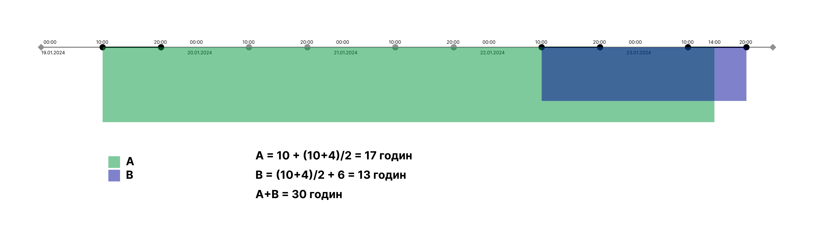

Перед початком скачайте файл `dump.sql` та загрузіть його в базу даних PosgreSQL за допомогою спеціальної команди або вручну виконавши команди для створення та заповнення таблиць

##### Що потрібно знати для того щоб виконати завдання:
1. Joins
2. Distinct
3. Window functions
4. Group by
5. Order by
6. Unions

# Тестове завдання
Ваше завдання складається з 5 пунктів, які рекомендовано виконувати послідовно. Результатом пунктів 1 та 2 має бути SQL запит який створить PostgresSQL View. 
Починаючи з пункту 3 можна використовувати будь-яку мову програмування(бажано python), або можете використати SQL 
Можете створювати будь-яку кількість проміжних таблиць та views 

### Структура
##### Таблиця issues:
Таблиця містить в собі всі задачі
- `issue_key` - ключ задачі
- `project_key` - ключ проекту
- `issue_type` - тип задачі (Task, Bug, Improvement, etc)
- `assignee_key` - ключ людини, яка назначена на задачу в даний момент
- `created_at` - дата створення задачі

##### Таблиця changelogs:
Таблиця містить в собі всі зміни статусів задач
- `issue_key` - ключ задачі
- `author_key` - ключ автора, який змінив статус
- `from_status` - з якого статусу задачу перенесли
- `to_status` - в який статус задачу перенесли
- `created_at` - дата зміни статусу

### Завдання:
1. Розрахуйте з якого по який час задача була в певному статусі. 
Результат: 
View який поверне наступну структуру - `issue_key`, `author_key`, `status`, `start_date`, `end_date`
2. Для кожного запису вирахувати скільки календарного часу в секундах кожна задача була в певному статусі
3. Для кожної задачі над якою працювала людина вирахувати скільки робочого часу задача була в статусі "In progress". Робочий час вважати з 10:00 по 20:00 з понеділка по пятницю
4. Якщо людина працює над декількома задачами одночасно - робочий час за цей період (коли він працює над декількома задачами) ділиться на кількість задач, над якими він працює.

Наприклад, 
Jason працював над задачею **A** з 10:00 19.01.2024 до 14:00 23.01.2024 
над задачею **B** з 10:00 22.01.2024 до 20:00 23.01.2024 
Маємо отримати

| issue_key | author_key | calendar_duration | working_duration |
| --- | --- | --- | --- |
| A | Jason | 360000 | 61200 |
| B | Jason | 122400 | 46800 |

Схематичне відображення:

5. Розрахувати загальну вартість всіх задач в межах типу задач. Тип задач знаходиться в таблиці `issues` колонка `issue_type`. Розрахувати за такою логікою:
 - Якщо `author_key` починається з "JIRAUSER" - ціна години часу такого спеціаліста $1.00
 - Якщо `author_key` НЕ починається з "JIRAUSER" - ціна години часу такого спеціаліста $2.00

Результат: 
Таблиця з полями - `issue_type`, `total_cost` 
Рекомендація: 
Для початку розрахуйте вартість кожної задачі. Наступним кроком дістаньте тип для кожної задачі та порахуйте суму для кожного типу